# Mapa normativo gerado

Origem: `ba36eb29036ccc2ed7dd2774e8daa5be96f572adc12536e58edb90e9b40537f4`; revisão: `53c494b`; tokenizer: `tiktoken 0.13.0` / `o200k_base` / `gpt-4o`.

Custos são tokens acumulados do conteúdo efetivamente carregado. Aresta passiva lê o nó integral; imediata lê até seu marcador inclusivo; folha e híbrido terminal incluem conteúdo integral; rotas distintas permanecem separadas e um nó compartilhado não é contado duas vezes na mesma rota.

```mermaid
flowchart TD
  core_agents["core.agents\nhybrid\n392 tokens"]
  core_agents_full["core.agents-full\nleaf\n7420 tokens"]
  core_authority["core.authority\nleaf\n1130 tokens"]
  core_microconcepts["core.microconcepts\nleaf\n3020 tokens"]
  core_contracts["core.contracts\nleaf\n1500 tokens"]
  core_routing["core.routing\nleaf\n1502 tokens"]
  core_update["core.update\nleaf\n2172 tokens"]
  role_final["role.final\nleaf\n577 tokens"]
  role_constructor["role.constructor\nderivation\n702 tokens"]
  scenario_constructor_operation["scenario.constructor-operation\nleaf\n902 tokens"]
  resource_scripts["resource.scripts\nhybrid\n1400 tokens"]
  resource_workflows["resource.workflows\nleaf\n873 tokens"]
  resource_traceability["resource.traceability\nleaf\n965 tokens"]
  scenario_request_lifecycle["scenario.request-lifecycle\nhybrid\n888 tokens"]
  scenario_refused_decisions["scenario.refused-decisions\nleaf\n1201 tokens"]
  scenario_official_gap["scenario.official-gap\nleaf\n555 tokens"]
  scenario_upstream_sharing["scenario.upstream-sharing\nhybrid\n1198 tokens"]
  scenario_issue_lifecycle["scenario.issue-lifecycle\nleaf\n441 tokens"]
  scenario_release["scenario.release\nhybrid\n1268 tokens"]
  capability_package_registry["capability.package-registry\nleaf\n457 tokens"]
  scenario_application_update["scenario.application-update\nleaf\n398 tokens"]
  scenario_content_publication["scenario.content-publication\nleaf\n422 tokens"]
  scenario_web_page_like["scenario.web-page-like\nhybrid\n388 tokens"]
  capability_web_browser["capability.web-browser\nleaf\n1401 tokens"]
  capability_web_static["capability.web-static\nleaf\n282 tokens"]
  capability_web_editorial["capability.web-editorial\nleaf\n1067 tokens"]
  meta_cli["meta.cli\nleaf\n139 tokens"]
  meta_build["meta.build\nleaf\n237 tokens"]
  meta_ia["meta.ia\nleaf\n107 tokens"]
  meta_maintenance["meta.maintenance\nleaf\n100 tokens"]
  meta_publish["meta.publish\nleaf\n135 tokens"]
  meta_release["meta.release\nleaf\n161 tokens"]
  meta_update["meta.update\nleaf\n201 tokens"]
  meta_upstream["meta.upstream\nleaf\n129 tokens"]
  meta_validation["meta.validation\nleaf\n99 tokens"]
  bootstrap_init_repo["bootstrap.init-repo\nleaf\n2977 tokens"]
  core_agents -->|"passive: always"| core_authority
  core_agents -->|"passive: partial-context or discovery"| core_routing
  core_agents -->|"passive: MN-* reference or ambiguity"| core_microconcepts
  core_agents -->|"passive: scenario, resource, hook, integration or manifest"| core_contracts
  core_agents -->|"passive: always in a consuming repository"| role_final
  core_agents -->|"passive: constructor operation"| role_constructor
  role_constructor -->|"passive: source, classification, build, dist, package, archive, update, distribution, release or publish"| scenario_constructor_operation
  core_agents -->|"passive: request intake or resume"| scenario_request_lifecycle
  scenario_request_lifecycle -->|"passive: every new request after source capture and before substantive analysis"| scenario_refused_decisions
  core_agents -->|"passive: apparent official gap"| scenario_official_gap
  core_agents -->|"passive: upstream proposal or inbox"| scenario_upstream_sharing
  scenario_upstream_sharing -->|"passive: constructor receives human-approved issue"| scenario_issue_lifecycle
  core_agents -->|"passive: governance install, update, repair or migration"| core_update
  core_agents -->|"passive: script, command, runtime, hook, callback, fallback or adapter"| resource_scripts
  resource_scripts -->|"passive: reusable CLI"| meta_cli
  core_agents -->|"passive: distributable workflow"| resource_workflows
  core_agents -->|"passive: technical unit or material traceability"| resource_traceability
  core_agents -->|"passive: release"| scenario_release
  scenario_release -->|"passive: RCF opts into package registry"| capability_package_registry
  core_agents -->|"passive: RCF opts into application update"| scenario_application_update
  core_agents -->|"passive: business content publication"| scenario_content_publication
  core_agents -->|"passive: web page like product"| scenario_web_page_like
  scenario_web_page_like -->|"passive: browser capability"| capability_web_browser
  scenario_web_page_like -->|"passive: static hosting capability"| capability_web_static
  scenario_web_page_like -->|"passive: editorial capability"| capability_web_editorial
  core_agents -->|"passive: build, dist, package or archive"| meta_build
  core_agents -->|"passive: agent command or AI output"| meta_ia
  core_agents -->|"passive: maintenance"| meta_maintenance
  core_agents -->|"passive: publish or deploy"| meta_publish
  core_agents -->|"passive: release execution"| meta_release
  core_agents -->|"passive: update:agents execution"| meta_update
  core_agents -->|"passive: upstream operation"| meta_upstream
  core_agents -->|"passive: validation"| meta_validation
  core_agents -->|"passive: repository normative bootstrap"| bootstrap_init_repo
  core_agents -->|"passive: route change, context loss, normative conflict, rule not found, invalid index/cache, preservation audit or low confidence"| core_agents_full
```

## Resumo

O desvio padrão é populacional e considera uma observação por rota válida.

| Terminal | Rotas | Mínimo | Média | Mediana | Desvio padrão | Máximo |
|---|---:|---:|---:|---:|---:|---:|
| Folha | 29 | 491 | 1674.41 | 1357 | 1431.66 | 7812 |
| Híbrido | 6 | 392 | 1249.0 | 1435.0 | 505.87 | 1792 |

## Caminhos

| ID | Rota | Terminal | Tokens |
|---|---|---|---:|
| path-001 | core.agents | hybrid | 392 |
| path-002 | core.agents → core.authority | leaf | 1522 |
| path-003 | core.agents → core.routing | leaf | 1894 |
| path-004 | core.agents → core.microconcepts | leaf | 3412 |
| path-005 | core.agents → core.contracts | leaf | 1892 |
| path-006 | core.agents → role.final | leaf | 969 |
| path-007 | core.agents → role.constructor → scenario.constructor-operation | leaf | 1996 |
| path-008 | core.agents → scenario.request-lifecycle | hybrid | 1280 |
| path-009 | core.agents → scenario.request-lifecycle → scenario.refused-decisions | leaf | 2481 |
| path-010 | core.agents → scenario.official-gap | leaf | 947 |
| path-011 | core.agents → scenario.upstream-sharing | hybrid | 1590 |
| path-012 | core.agents → scenario.upstream-sharing → scenario.issue-lifecycle | leaf | 2031 |
| path-013 | core.agents → core.update | leaf | 2564 |
| path-014 | core.agents → resource.scripts | hybrid | 1792 |
| path-015 | core.agents → resource.scripts → meta.cli | leaf | 1931 |
| path-016 | core.agents → resource.workflows | leaf | 1265 |
| path-017 | core.agents → resource.traceability | leaf | 1357 |
| path-018 | core.agents → scenario.release | hybrid | 1660 |
| path-019 | core.agents → scenario.release → capability.package-registry | leaf | 2117 |
| path-020 | core.agents → scenario.application-update | leaf | 790 |
| path-021 | core.agents → scenario.content-publication | leaf | 814 |
| path-022 | core.agents → scenario.web-page-like | hybrid | 780 |
| path-023 | core.agents → scenario.web-page-like → capability.web-browser | leaf | 2181 |
| path-024 | core.agents → scenario.web-page-like → capability.web-static | leaf | 1062 |
| path-025 | core.agents → scenario.web-page-like → capability.web-editorial | leaf | 1847 |
| path-026 | core.agents → meta.build | leaf | 629 |
| path-027 | core.agents → meta.ia | leaf | 499 |
| path-028 | core.agents → meta.maintenance | leaf | 492 |
| path-029 | core.agents → meta.publish | leaf | 527 |
| path-030 | core.agents → meta.release | leaf | 553 |
| path-031 | core.agents → meta.update | leaf | 593 |
| path-032 | core.agents → meta.upstream | leaf | 521 |
| path-033 | core.agents → meta.validation | leaf | 491 |
| path-034 | core.agents → bootstrap.init-repo | leaf | 3369 |
| path-035 | core.agents → core.agents-full | leaf | 7812 |
